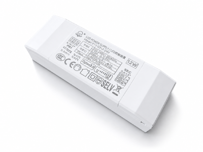

# 耐利普科技网站 - 操作教程

> 本教程面向非技术人员，手把手教你如何部署网站、更新文章、修改产品信息。

---

## 目录

1. [网站文件结构说明](#1-网站文件结构说明)
2. [如何部署上线](#2-如何部署上线)
3. [如何新增技术文章](#3-如何新增技术文章)
4. [如何修改产品信息](#4-如何修改产品信息)
5. [如何修改公司联系方式](#5-如何修改公司联系方式)
6. [常见问题](#6-常见问题)

---

## 1. 网站文件结构说明

```
nexlamp-website/
├── index.html          ← 首页
├── products.html       ← 产品中心页
├── blog.html           ← 技术文章列表页
├── style.css           ← 全站样式（一般不需要改）
├── main.js             ← 全站交互脚本（一般不需要改）
├── post.html           ← 文章模板（build.js 用，不要改）
├── build.js            ← 构建脚本（将 Markdown 转为 HTML）
├── webhook-receiver.js ← Webhook 接收器（高级用途）
├── posts/              ← ⭐ 文章 Markdown 源文件（你主要操作的目录）
│   ├── dali-2-compatibility-guide.md
│   ├── led-driver-selection-guide.md
│   └── ...
└── dist/blog/          ← build.js 自动生成的 HTML（不要手动改）
    ├── dali-2-compatibility-guide.html
    └── ...
```

**你只需要关心的文件：**
- `posts/` 文件夹里的 `.md` 文件 → 管理文章内容
- `products.html` → 管理产品信息
- `index.html` → 首页（偶尔可能要改）

---

## 2. 如何部署上线

### 方案 A：GitHub Pages（推荐，免费）

**步骤：**

1. 注册 GitHub 账号：https://github.com/signup
2. 创建新仓库（Repository），名称随便，比如 `nexlamp-website`
3. 把整个 `nexlamp-website` 文件夹的文件上传到仓库
4. 进入仓库 → Settings → Pages → Source 选 `main` 分支 → Save
5. 几分钟后你的网站就在 `https://你的用户名.github.io/nexlamp-website/` 上线了

**绑定自定义域名 www.nexlamp.com：**

6. 在仓库根目录创建文件 `CNAME`，内容写一行：`www.nexlamp.com`
7. 到你的域名管理商（阿里云/腾讯云/GoDaddy）添加 DNS 记录：
   - 添加 CNAME 记录：主机记录 `www`，记录值 `你的用户名.github.io`
   - 等待 DNS 生效（最长48小时，通常10分钟）

### 方案 B：Vercel（推荐，免费，更快）

1. 注册 Vercel：https://vercel.com/signup
2. 用 GitHub 账号登录
3. 点 "Import Project" → 选你的 GitHub 仓库
4. Framework 选 "Other"，Output Directory 填 `.`（根目录）
5. 点 Deploy → 几秒钟上线
6. 在 Settings → Domains 绑定 `www.nexlamp.com`

### 方案 C：传统服务器 / 虚拟主机

1. 把以下文件上传到网站根目录：
   - `index.html`、`products.html`、`blog.html`
   - `style.css`、`main.js`
   - `dist/` 整个文件夹
   - `CNAME`（如果绑定域名）
2. 不需要上传 `posts/`、`build.js`、`webhook-receiver.js`（这些是构建工具）
3. 确保服务器默认首页设为 `index.html`

---

## 3. 如何新增技术文章

### 第 1 步：创建 Markdown 文件

在 `posts/` 文件夹中新建一个 `.md` 文件，文件名用英文，比如 `zigbee-mesh-deployment.md`

### 第 2 步：写入文章内容

用任意文本编辑器（记事本、VS Code、Notepad++ 都行）打开文件，按以下格式写入：

```markdown
---
title: Zigbee Mesh网络部署实战
date: 2025-05-15
category: 部署指南
description: 从零开始搭建Zigbee Mesh智能照明网络，涵盖设备选型、组网配置与优化技巧。
keywords: Zigbee,Mesh组网,智能照明部署
slug: zigbee-mesh-deployment
---

## 前期准备

在开始部署之前，你需要准备以下设备...

### 设备清单

- Zigbee 3.0 协调器 × 1
- Zigbee 路由器 × 若干
- LED 驱动电源（Zigbee版）× N

## 组网步骤

1. 上电协调器
2. 逐个添加路由节点
3. 配置场景和自动化规则

> 提示：每个路由节点之间距离不要超过15米。

正文内容可以写很长...
```

**Front Matter（文件头）各字段说明：**

| 字段 | 必填 | 说明 | 示例 |
|------|------|------|------|
| `title` | ✅ | 文章标题 | `Zigbee Mesh网络部署实战` |
| `date` | ✅ | 发布日期 | `2025-05-15` |
| `category` | ✅ | 分类标签 | `部署指南` |
| `description` | ✅ | SEO描述（搜索引擎显示） | `从零开始搭建...` |
| `keywords` | ❌ | SEO关键词 | `Zigbee,Mesh组网` |
| `slug` | ✅ | URL文件名（英文） | `zigbee-mesh-deployment` |

### 第 3 步：运行构建

打开命令行（在 nexlamp-website 目录下），运行：

```bash
node build.js
```

看到输出 `✅ Build complete!` 就成功了。生成的 HTML 文件在 `dist/blog/` 目录。

### 第 4 步：更新博客列表页

打开 `blog.html`，在 `blog-list` 区域复制一个已有的 `<article class="blog-item">` 块，修改其中的标题、日期、链接和描述。

**要改的地方：**

```html
<!-- 复制一个这样的块，修改以下几处 -->
<article class="blog-item">
    <div class="blog-item-image">
        
    </div>
    <div class="blog-item-body">
        <div class="blog-meta">
            <time datetime="2025-05-15">2025年5月15日</time>  ← 改日期
            <span class="blog-tag">部署指南</span>              ← 改分类
        </div>
        <h3><a href="dist/blog/zigbee-mesh-deployment.html">Zigbee Mesh网络部署实战</a></h3>  ← 改标题和链接
        <p>从零开始搭建Zigbee Mesh智能照明网络...</p>  ← 改描述
    </div>
</article>
```

### 第 5 步：上传部署

把更新后的文件上传到服务器或推送至 GitHub。

---

## 4. 如何修改产品信息

产品信息直接写在 `products.html` 里，找到对应的产品卡片修改即可。

### 修改现有产品

打开 `products.html`，每个产品是一个 `<article class="product-card product-detail">` 块：

```html
<article class="product-card product-detail">
    <div class="product-image">
        <!-- 改产品图片：把 src 换成实际图片路径 -->
        
    </div>
    <div class="product-info">
        <h4>涂鸦恒流驱动电源 7-12W</h4>          ← 改产品名称
        <ul class="product-specs">
            <li>功率范围：7-12W</li>               ← 改规格参数
            <li>输入电压：AC 85-265V</li>
            <li>认证：3C认证</li>
            <li>调光方式：PWM / 0-10V</li>
            <li>效率：≥90%</li>
        </ul>
        <p class="product-desc">适用于智能灯具...</p>  ← 改产品描述
    </div>
</article>
```

### 新增一个产品

1. 找到对应的产品分类区域（如 `LED恒流驱动电源`）
2. 复制一个已有的 `<article class="product-card product-detail">` 块
3. 粘贴到该分类的 `<div class="grid grid-3">` 内
4. 修改图片、名称、规格、描述

### 新增一个产品分类

在 `products-section` 区域内，复制一个完整的 `<div class="product-category">` 块：

```html
<div class="product-category">
    <h3 class="category-title">新分类名称</h3>  ← 改分类名
    <div class="grid grid-3">
        <!-- 在这里放产品卡片 -->
    </div>
</div>
```

### 替换产品图片

1. 把实际产品图片放到网站根目录的 `images/` 文件夹（需新建）
2. 把 `` 的 `src` 从占位图改为实际路径：

```html
<!-- 修改前（占位图） -->


<!-- 修改后（实际图片） -->

```

**图片建议：** 宽400px、高300px，JPG格式，每张不超过200KB

---

## 5. 如何修改公司联系方式

公司信息（名称、电话、域名）出现在以下位置，需要逐一修改：

### 全局搜索替换

最简单的方式：在编辑器里全局搜索以下关键词并替换

| 搜索 | 替换为 |
|------|--------|
| `13825496855` | 新电话号码 |
| `www.nexlamp.com` | 新域名 |
| `Nexlamp Technology Co., Ltd.` | 新英文名 |
| `耐利普科技有限公司` | 新中文名 |

### 每个文件的具体位置

**index.html** — 首页
- 行 6-7：`<title>` 和 `<meta description>`
- 行 26-42：JSON-LD Organization Schema
- 行 198-199：CTA 区电话
- 行 219、220、231-233：Footer 联系方式

**products.html** — 产品页
- 行 6-7：`<title>` 和 `<meta description>`
- 行 24-26：JSON-LD Product Schema
- 行 277：CTA 区电话
- 行 298-299、311-313：Footer 联系方式

**blog.html** — 博客页
- 行 6-7：`<title>` 和 `<meta description>`
- 行 28-35：JSON-LD Blog Schema
- 行 298-299、311-313：Footer 联系方式

**post.html** — 文章模板
- 行 35-44：JSON-LD Article Schema
- 行 73：Footer 联系方式

---

## 6. 常见问题

### Q: 修改文章后页面没变化？
A: 你需要重新运行 `node build.js` 来重新生成 HTML。如果部署在 GitHub Pages 上，还要 git push 更新上去。

### Q: 文章中可以插入图片吗？
A: 可以。把图片放到 `images/` 目录，在 Markdown 中写：
```markdown

```

### Q: 如何删除一篇文章？
A: 两步操作：
1. 删除 `posts/` 中对应的 `.md` 文件
2. 删除 `dist/blog/` 中对应的 `.html` 文件
3. 从 `blog.html` 中删除对应的文章列表项
4. 重新运行 `node build.js`

### Q: 产品图片如何优化加载速度？
A: 建议用 TinyPNG（https://tinypng.com/）压缩图片，每张控制在 100-200KB 以内。所有产品图片统一尺寸 400×300px。

### Q: 如何查看网站在手机上的效果？
A: 在浏览器中按 F12 打开开发者工具，点左上角的手机图标切换到移动端预览。

### Q: slug 是什么？可以写中文吗？
A: slug 是 URL 中的文件名部分，**必须用英文**，不能包含中文或特殊字符。比如 `dali-2-guide` 是对的，`DALI-2指南` 是错的。

### Q: 我想让网站支持多语言怎么办？
A: 目前是中文版。如需英文版，可以复制一份英文 HTML 文件，在文件名加 `-en` 后缀，如 `products-en.html`。

---

## 快速参考卡片

```
新增文章：  posts/ 里新建 .md → node build.js → 更新 blog.html → 上传
修改产品：  直接改 products.html → 上传
改联系方式：全局搜索替换 → 上传
部署上线：  推送到 GitHub → GitHub Pages / Vercel 自动发布
```
