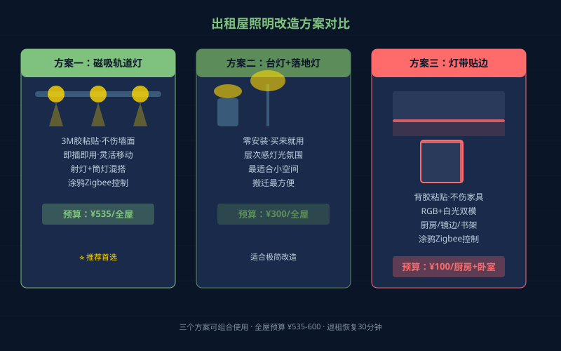
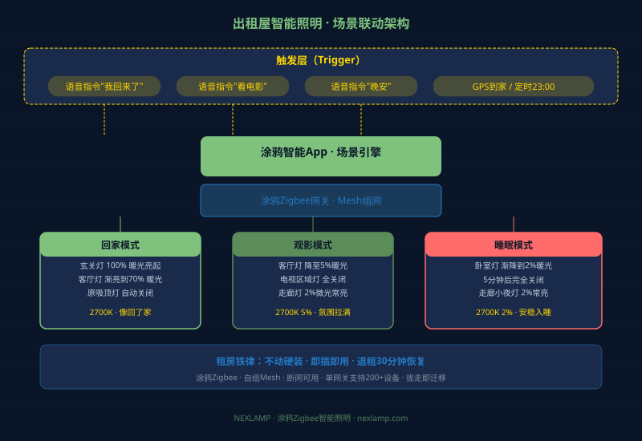
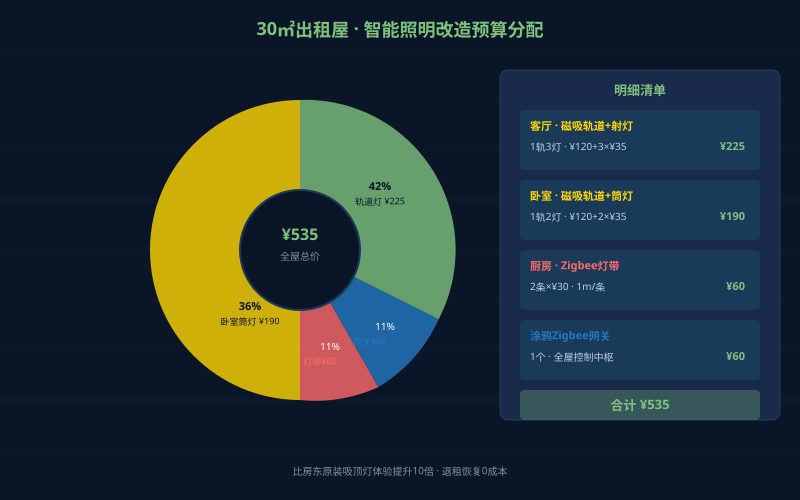

# 出租屋智能照明改造：租房党也能拥有好灯光

小红书上的出租屋改造笔记动辄百万浏览——刷墙、换窗帘、买软装，但很少有人提到最影响居住体验的一件事：**灯光**。

出租屋的灯，通常是房东配的廉价吸顶灯——冷白光刺眼、单色温没选择、显色指数低到看不清食物本色。晚上回家打开灯，像走进办公室；关灯刷手机，又漆黑一片。

但你没法换灯——房东不让改线，退租要恢复原状，预算也有限。

今天这篇，就是给租房党写的：**最不伤墙、最不伤钱、退租半小时恢复的智能照明改造方案**。

## 租房照明的三个铁律

开始之前，先记住三条底线：

1. **不动硬装**：不改线路、不打孔、不换开关面板——房东验收直接扣钱
2. **即插即用**：所有灯具拿回家插上就能用，搬走一拔带走——零遗留
3. **预算可控**：单个空间改造不超过500元，全屋不超过2000元

满足这三条的方案，才是租房党真正能用的方案。

## 方案一：智能射灯/筒灯 + 磁吸轨道

这是出租屋改造的王牌方案。**磁吸轨道灯**直接贴在顶面或墙面，不需要打孔——3M胶贴上去，退租撕下来不留痕。轨道上可以灵活插入射灯和筒灯，想加灯就加，想移位置就移。

配上涂鸦Zigbee智能射灯，你得到的是：

- **6档调光**：从5%到100%，深夜2%的微光也够用
- **色温切换**：2700K暖光追剧、4000K中性光做饭、6500K冷白看书
- **场景联动**：一句话"开观影模式"，客厅灯自动降到10%暖光

关键参数选灯时注意：

| 参数 | 出租屋推荐值 | 说明 |
|------|-------------|------|
| 开孔尺寸 | 无需开孔（磁吸轨道） | 租房不能动天花板 |
| 显色指数 | Ra≥90 | 低于90看不清肤色和食物 |
| 功率 | 3-7W/灯 | 小空间够用，电费也省 |
| 控制方式 | 涂鸦Zigbee | 不依赖WiFi，断网也能用 |
| 光束角 | 15°/24°/36°可选 | 射灯做重点照明，筒灯做基础照明 |

> NEXLAMP的NEX4-9系列射灯全部Ra98显色指数，12W涂鸦Zigbee版本即插即用，开孔最小75mm——但如果你连开孔都不想，磁吸轨道是最佳搭配。

## 方案二：智能台灯 + 落地灯组合

不想装轨道灯？用台灯+落地灯也能做出层次感。

- **智能台灯放床头**：2700K暖光做睡前阅读，定时30分钟后自动渐灭——比盯着手机刷到凌晨健康得多
- **落地灯放沙发旁**：36°光束角打一面白墙，漫反射出柔和的间接光——房间瞬间有氛围
- **再配一个小夜灯**：2%亮度的Zigbee小灯放在走廊，半夜起床不刺眼

三盏灯总价不超过300元，但体验比出租屋原装吸顶灯好10倍。

## 方案三：灯带贴柜底/镜边

小红书爆款改造里最常见的操作——**灯带贴在橱柜底部、镜子边缘、书架内侧**。

涂鸦Zigbee灯带的好处：

- 背胶粘贴，不伤家具表面
- 支持RGB彩光+白光双模，做饭用白光、拍照用彩光
- 手机一键切换场景，不用摸开关

一根1米灯带不到30块，3根贴完厨房和卧室，总共不到100块——但厨房从"暗角死角"变成"清晰明亮"，卧室从"压抑灰暗"变成"温暖有层次"。

## 场景联动：灯要跟着你的生活走

灯买回来只是第一步，**场景联动**才是智能照明灵魂。

涂鸦App里的场景设置，租房党建议配这3个：

### 场景1：回家模式
- 触发条件：手机GPS到家附近 / 语音"我回来了"
- 执行动作：玄关灯100%暖光亮起 → 3秒后客厅灯渐亮到70%暖光 → 廉价吸顶灯关掉

### 场景2：观影模式
- 触发条件：语音"看电影" / App一键
- 执行动作：所有灯降到5%暖光 → 电视区域灯完全关闭 → 走廊留2%微光

### 场景3：睡眠模式
- 触发条件：语音"晚安" / 定时23:00
- 执行动作：卧室灯渐降到2%暖光 → 5分钟后完全关闭 → 走廊小夜灯2%常亮

## Zigbee vs WiFi：租房党该选哪个？

出租屋的网络环境通常不好——路由器是房东的老款，信号隔一个房间就弱了。这时候Zigbee的优势特别明显：

| 对比项 | 涂鸦Zigbee | WiFi灯 |
|--------|-----------|---------|
| 网络依赖 | 自组网mesh，断WiFi也能控 | 断WiFi就失联 |
| 响应速度 | <0.5秒 | 1-3秒（路由器差时更慢） |
| 设备容量 | 单网关支持200+灯 | 路由器挂20个设备就卡 |
| 功耗 | 灯关闭时网关仍在线 | 设备常连WiFi耗电 |
| 退租迁移 | 网关一拔带走全部设备 | 每个灯需重新配网 |

**结论：租房党选Zigbee，不是因为技术更先进，是因为实际体验更稳。**

## 预算清单：全屋改造参考

以30㎡典型出租屋为例（客厅+卧室+厨房）：

| 区域 | 灯具 | 数量 | 单价(约) | 小计 |
|------|------|------|---------|------|
| 客厅 | 磁吸轨道+3W射灯 | 1轨3灯 | ¥120/轨+¥35/灯 | ¥225 |
| 卧室 | 磁吸轨道+3W筒灯 | 1轨2灯 | ¥120/轨+¥35/灯 | ¥190 |
| 厨房 | Zigbee灯带1m | 2条 | ¥30/条 | ¥60 |
| 全屋 | 涂鸦Zigbee网关 | 1个 | ¥60 | ¥60 |
| **合计** | | | | **¥535** |

不到600块，你的出租屋灯光体验从"办公室冷白"变成"回家就是温暖"。

## 退租恢复：半小时搞定

最关键的一步——退租时怎么恢复：

1. **磁吸轨道**：3M胶残留用酒精棉擦，10分钟搞定
2. **灯带**：背胶撕下，酒精擦柜面，不留痕迹
3. **网关**：拔电源带走，涂鸦App删除设备即可
4. **原装吸顶灯**：开关恢复到房东原始状态——因为你一直用的是智能灯，开关面板从来没动过

整个过程不超过30分钟，房东验收零扣款。

## 写在最后

出租屋的灯光，不该是你妥协的第一个东西。

你改变不了墙的颜色，改变不了地板的材质，但你能改变光线——而光线是影响居住幸福感最直接的元素。一盏2700K的暖光射灯打在白墙上，比刷一面彩色墙更温暖；一条灯带照亮厨房死角，比换新橱柜更实用。

租房党不是没有选择，只是需要更聪明的选择。涂鸦Zigbee智能照明就是那个选择——即插即用、断网可用、退租可带走。

---

*Nexlamp——涂鸦Zigbee智能照明，即插即用，租房也能拥有好灯光。*

*了解更多：[nexlamp.com](https://www.nexlamp.com)*
