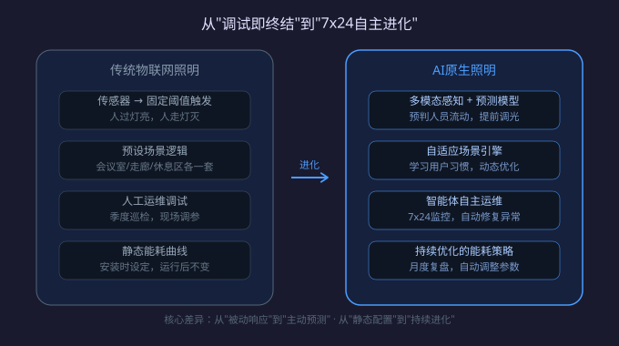
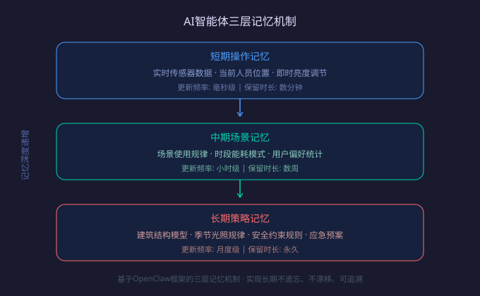
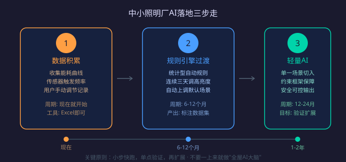

# AI原生照明时代来了：GenAI智能体不是噱头，是救命稻草

> 2026年7月22日 · NEXLAMP技术团队

## 一、先讲一个扎心的现状

你花了三个月调试好的智能照明系统，交付给客户时一切完美——感应灵敏、调光顺滑、场景切换丝滑。但半年后客户打电话来："走廊灯半夜自己亮了""会议室场景按钮没反应了""能耗比预期高了30%"...

这就是物联网照明阶段的典型困境：**调试即终结**。系统一旦交付，就僵死在最初设定的逻辑里。传感器只能按预设阈值触发，无法适应季节变化、人员流动规律的变化，更谈不上"越用越聪明"。

昕诺飞2026年白皮书把这个问题说得很透：第一代生成式AI被引入照明控制后，通用模型因为不懂光学物理规律、电气安全标准和建筑逻辑，极易产生"幻觉"指令——比如在人员密集区域自动调暗灯光，或者在雷雨天气错误切换户外照明策略。这种"概率性输出"用在物理基础设施上，风险极大。

## 二、什么叫"AI原生照明"？

不是给现有系统加个语音控制就叫AI照明。真正的AI原生照明需要三个核心能力：

**1. 长期自主运行（Long Running）**

系统7×24小时在线，不是定时巡检，而是持续感知环境变化并自主调整。借鉴OpenClaw框架的三层记忆机制——短期操作记忆、中期场景记忆、长期策略记忆——实现"长期不遗忘、长期不漂移、长期可追溯"。

**2. 长周期决策（Long Horizon）**

不只是"有人经过就亮灯"，而是能基于历史数据预测：下周三是端午节假期，办公区照明策略应该提前切换到节能模式；连续阴雨一周后，室内光照补偿算法需要调高15%。

**3. 物理安全约束**

这是最关键的区别。昕诺飞提出的"驾驭工程学（Harness Engineering）"六层约束框架，把大模型的概率性输出转化为稳定、合规、可追溯的行业控制行为。简单说就是：AI可以建议，但每一条指令都要经过安全校验——电气负荷上限、应急照明法规、人员安全标准，一个都不能突破。

## 三、对中小照明厂意味着什么？

听到"AI"两个字，很多中小厂商的第一反应是："这是昕诺飞、欧司朗这些大厂才能玩的，跟我有什么关系？"

错了。恰恰相反，**AI原生照明是中小厂弯道超车的机会**。

**第一，降低运维门槛。** 传统智能照明项目交付后，厂家需要长期驻场维护或频繁上门调试。AI智能体可以自主处理80%的运维问题，中小厂可以用更少的人力服务更多客户。

**第二，从卖硬件转向卖服务。** 按使用时长、节能效果付费的模式（Lighting-as-a-Service）在欧美已经占比27%。AI智能体让这种商业模式成为可能——系统持续优化能耗，客户看到实实在在的电费账单下降，才愿意持续付费。

**第三，差异化竞争。** 当大厂还在推标准化方案时，中小厂可以借助AI快速定制细分场景——比如针对服装店的显色指数自适应算法、针对仓储物流的叉车路径预判照明、针对养老院的防跌倒夜灯策略。这些长尾需求，大厂看不上，但AI可以低成本满足。

## 四、落地三步走（务实版）

**第一步：数据积累（现在就可以做）**

不要急着上AI，先把现有项目的运行数据收集起来。能耗曲线、传感器触发频率、用户手动调节记录——这些数据是训练行业模型的燃料。哪怕只是用Excel记录，也比没有强。

**第二步：规则引擎过渡（6-12个月）**

先用确定性规则实现"伪智能"。比如：如果连续三天同一时段有人手动调高亮度，系统自动将该时段的默认亮度上调10%。这种基于统计的规则不需要AI，但能为后续模型训练提供标注数据。

**第三步：引入轻量AI（12-24个月）**

选择有"约束框架"的AI平台，确保输出可控。从单一场景切入——比如只用AI优化会议室的照明策略，验证效果后再扩展。不要一上来就做"全屋AI大脑"，步子太大容易扯着蛋。

## 五、写在最后

2026年全球智能照明市场规模预计突破1000亿美元，其中控制系统（含软件、智能开关及中央网关）已占54%以上份额。这意味着**卖灯的竞争已经结束了，卖"光环境"的竞争才刚刚开始**。

AI原生照明不是要不要做的问题，是什么时候做、怎么做的问题。大厂有资金优势，但中小厂有场景理解深度和灵活度。关键是别被"AI"两个字吓到，从数据积累开始，小步快跑，反而可能更快找到属于自己的生态位。

毕竟，在AI时代，最值钱的不是算力，而是对具体场景的理解——而这，恰恰是深耕行业多年的中小厂商最大的优势。

---

*NEXLAMP专注涂鸦Zigbee智能照明解决方案，为商业、工业及家居场景提供稳定可靠的智能驱动与控制系统。*
