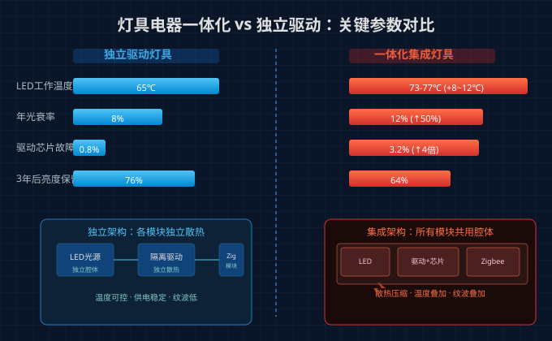
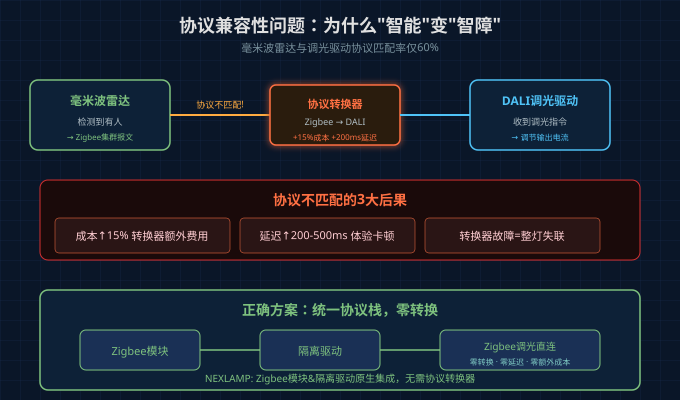
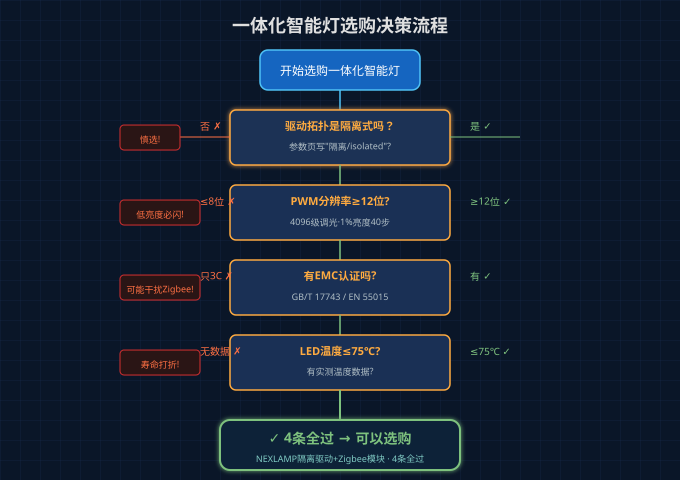

# 智能灯越"集成"越不稳定？灯具电器一体化这3个暗坑你踩过吗

买了"一体化智能灯"，安装确实方便——不用再单独配驱动、接线、调参数。但用了三个月，灯开始随机掉线、低亮度频闪、甚至整灯报废。

2026年行业报告显示：LED智能照明市场占比已超80%，"光源+驱动+控制"一体化成为主流方向。但集成化带来的问题，远比想象中严重。

**行业实测数据**：集成灯具的智能驱动芯片故障率达3.2%，独立灯具仅0.8%——翻了4倍。光衰率从每年8%飙到12%。这背后，是3个你可能从未听说过的暗坑。

## 暗坑一：协议适配率低，"智能"变"智障"

灯具电器一体化意味着LED光源、恒流驱动、通信模块（Zigbee/BLE/WiFi）全部塞在一个外壳里。听起来简洁，但各模块之间的"对话"并不顺畅。

**核心矛盾**：调光驱动与通信模块的协议握手。

举个实例：毫米波雷达传感器检测到有人，发出调光指令。但调光驱动用的是DALI协议，雷达模块走的是Zigbee集群报文——两者协议不匹配，中间需要加一个协议转换器。

**后果**：
- 硬件成本增加15%（协议转换器额外费用）
- 控制延迟增加200-500ms（转换器处理时间）
- 转换器本身又是故障点，一坏整灯失联

行业数据显示：家居场景下毫米波雷达与调光驱动的协议匹配率不足60%。这意味着近一半的"智能"功能在实际使用中是半残状态。

## 暗坑二：散热空间被压缩，寿命打折你看不见

一体化设计把光源、驱动、通信芯片全部挤进一个筒灯外壳。原本驱动电源需要独立散热空间，现在和LED光源共用一个狭小的腔体。

**实测数据对比**：

| 参数 | 独立驱动灯具 | 一体化集成灯具 |
|------|-------------|---------------|
| LED工作温度 | 65℃ | 73-77℃（+8~12℃） |
| 年光衰率 | 8% | 12% |
| 驱动芯片故障率 | 0.8% | 3.2% |
| 3年后亮度保留 | 76% | 64% |

温度升高8-12℃看起来不起眼，但对LED来说就是致命的。LED寿命与温度呈指数关系——温度每升高10℃，寿命减半。

3年后，一体化灯具亮度只剩64%，而独立驱动灯具还有76%。你花了同样的钱，得到的是一块更快变暗的灯。

更关键的是：驱动芯片在高温下故障率飙到3.2%。芯片一旦烧毁，整灯报废——不只是"不智能了"，而是连灯都不亮了。

## 暗坑三：低亮度调光振荡，"无频闪"是假的

很多一体化灯具标称"0-100%无频闪调光"，实际在低亮度（1%-10%）区域出现严重问题。

**原理**：廉价驱动在低PWM占空比下失去电流调节能力，环路补偿不足导致低频振荡。结果是：

- 亮度1%时，手机慢动作模式能看到明显脉冲
- 通信模块因供电纹波过大而间歇掉线
- 人眼虽不直接感知频闪，但长时间暴露会导致视疲劳和头痛

**诊断方法**：用手机慢动作摄像头（240fps以上）拍摄低亮度下的灯具。如果看到规律性明暗脉冲，说明驱动的PWM分辨率不够——低于12位（4096级）的驱动在1%亮度时只有40个离散调光步，根本做不到平滑。

## 4条选型准则：一体化怎么选才靠谱

不是所有一体化都有问题。选对了，确实省事省心。关键看这4点：

**1. 驱动拓扑必须是隔离式**

非隔离驱动（DOB方案）输出纹波大，直接威胁通信模块供电稳定性。隔离驱动通过变压器实现电气隔离，纹波降低一个数量级。

判断方法：产品参数页写"隔离式"或"isolated driver"→优选；只写"恒流"不说拓扑→大概率是非隔离，谨慎。

**2. PWM分辨率≥12位（4096级）**

这是低亮度无频闪的硬指标。12位PWM在1%亮度时提供40个离散步，足够平滑；8位（256级）在1%时只有2-3步，必闪。

**3. 认证必须包含EMC（电磁兼容）**

CCC认证只是安全底线。EMC认证（GB/T 17743 / EN 55015）确保驱动不会通过电源线辐射2.4GHz噪声干扰Zigbee/BLE通信。没有EMC认证的驱动，就是隔壁灯的"掉线炸弹"。

**4. 散热设计要看实测温度数据**

好的产品会标注LED最高工作温度和驱动芯片温度。如果超过75℃，寿命和可靠性都会打折。优先选择有散热模拟报告或实测数据的产品。

## Nexlamp的做法：合理集成而非暴力压缩

Nexlamp的一体化方案走的是"隔离驱动+Zigbee模块合理集成"路线，而非把所有模块暴力压缩到最小空间：

- **隔离式恒流驱动**：输出纹波≤±5%，保障Zigbee模块供电稳定
- **驱动与光源分离散热**：驱动PCB独立区域，不与LED共腔体
- **12位PWM调光**：1%亮度仍有40级平滑输出，无低频振荡
- **EMC认证齐全**：GB/T 17743 + 3C认证双重保障

一体化的优势是真实存在的——安装简单、减少接线错误、整体调试更便捷。但前提是集成方案尊重每个模块的物理需求，而不是为了"一体化"而牺牲可靠性。

---

**NEXLAMP** — 涂鸦Zigbee智能照明 & 隔离式LED驱动电源 | [www.nexlamp.com](https://www.nexlamp.com)
